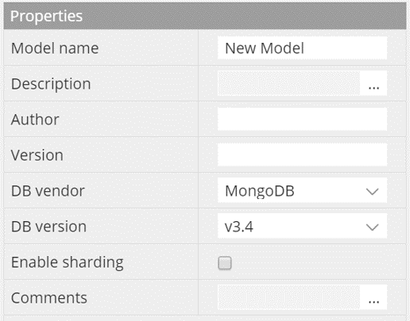

Hackolade NoSQL DB data modeling plugins
========================================

Repository for plugins to let new NoSQL document databases leverage the
Hackolade data modeling engine, if they're not natively supported in Hackolade
(yet.)

 

The plugin architecture of Hackolade lets you create your own NoSQL database
‘targets’, following its terminology, attributes, and storage model through the
customization of the following modules:

1.  properties panes

2.  localization

3.  data types

4.  connection and authentication parameters (TBD)

5.  reverse-engineering parameters for sampling and schema inference (TBD)

 

This guide walks you through the steps necessary to create your own plugin in
your github repository and test it.  Once you’re ready to make your plugin
public, you may create a pull request for your entry in the registry file in
this repo.

 

Overview
--------

Each NoSQL document database has its own personality: terminology, storage
approach, primary keys, indexing, partionning/sharding, data types, API, etc...
At Hackolade, after adapting our engine to a couple of rather different NoSQL
vendors, we quickly realized that we were going to have a hard time keeping up
with the frequent appearance of new databases on the market.  So, in order to
unleash the power of our data modeling engine, we decided to rewrite the
application and open up our features through a plugin architecture.

 

With the customization of the properties pane, you’ll be able to control
attributes specific to each DB at the following levels: model, container,
collection, attribute, indexing, sharding, etc...

{:height="50%" width="50%"}

You can add the appropriate property labels and control the input types.

 

Usage
-----

TODO: Write usage instructions

Contributing
------------

1.  Fork it!

2.  Create your feature branch: `git checkout -b my-new-feature`

3.  Commit your changes: `git commit -am 'Add some feature'`

4.  Push to the branch: `git push origin my-new-feature`

5.  Submit a pull request :D

History
-------

TODO: Write history

Credits
-------

TODO: Write credits

License
-------

TODO: Write license
