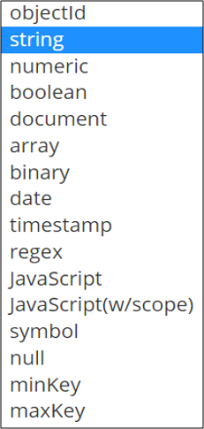
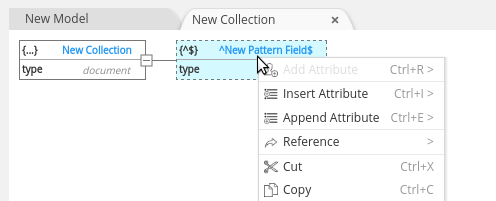
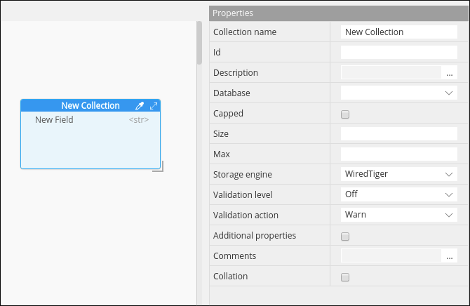
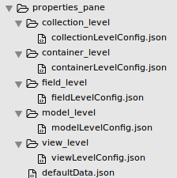
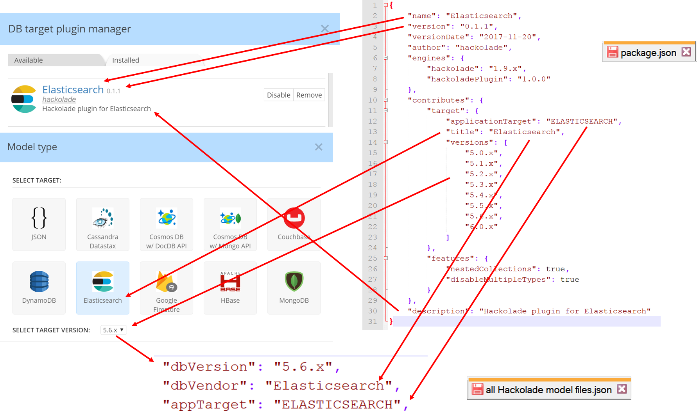
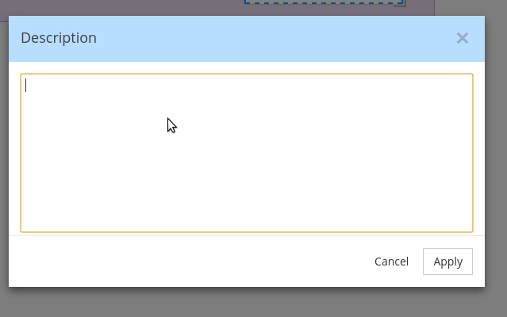

Hackolade NoSQL DB data modeling plugins
========================================

Repository for plugins to let new NoSQL document databases leverage the
Hackolade data modeling engine, if they're not natively supported in Hackolade
(yet.)

The plugin architecture of Hackolade lets you create your own NoSQL database
‘targets’, following its terminology, attributes, and storage model through the
customization of the following modules:

1.  properties panes

2.  localization

3.  data types

4.  connection and authentication parameters

5.  reverse-engineering parameters for sampling and schema inference (TBD)  

This guide walks you through the steps necessary to create your own plugin in
your github repository and test it. Once you’re ready to make your plugin
public, you may create a pull request for your entry in the registry file in
this repo.  

Overview
--------

Each NoSQL document database has its own personality: terminology, storage
approach, primary keys, indexing, partionning/sharding, data types, API, etc...
At Hackolade, after adapting our engine to a couple of rather different NoSQL
vendors, we quickly realized that we were going to have a hard time keeping up
with the frequent appearance of new databases on the market. So, in order to
unleash the power of our data modeling engine, we decided to rewrite the
application and open up our features through a plugin architecture.

With the customization of the properties pane, you're able to control attributes
specific to each DB at the following levels: model, container, collection,
attribute, indexing, sharding, etc...

You can add the necessary property labels and control the input types.

You can also define the entity hierarchy of the database:

Each data type has its own set of properties and behaviour described in the
configurations. Type changes affect UI of ERD (model view), DTD (collection tree
view) and behaviour of the contextual menu:

The easiest way to create a new plugin is to copy an existing one as a starting
point, and to edit it progressively, verifying along the way that the desired
behavior gets reflected in the application. When choosing an existing plugin,
make sure to take one with a storage model as cole as possible to yours.

Plugin structure
----------------

Plugins are stored in the \~/**.hackolade/plugins** directory. The plugin folder
name should be the same as the **name** property in package.json file of your
plugin.

The **package.json** file is the plugin entry point. This file is required and
contains initial info about plugin such as name, version, author, target name
etc.. It should be placed in the root of your plugin folder. Package.json should
contain several required properties that guarantee its uniqueness:

-   *Name*

-   *Contributes*

-   *Author*

*See more details about each field of* [package.json](#package.json) *file.*

**logo.jpg** - the plugin logo image that will be displayed in the list of
plugins. Name and extension of the file cannot be changed. The file is placed in
the root folder next to the package.json file. If not set - the first letter
from **name** property in package.json file will be used instead of logo.

[1] Properties pane structure
----------------

Properties pane visual structure depends on the selected item (entity). There
are several entity types in Hackolade that change the structure:

1.  model

2.  container

3.  collection

4.  view

5.  field

Each entity can have several tabs. Current version supports customizing
**details** tab only.

All configurations are stored in **properties_pane** folder and situated in the
root of plugin folder. Each entity has own folder with corresponding naming:

-   **model_level**

-   **container_level**

-   **collection_level**

-   **view_level**

-   **field_level**

Inside each folder there’s a **[ENTITYNAME]LevelConfig.json** file which
contains configurations for PP.

You can add **defaultData.json** file to a **properties_pane** folder to define
default values that will be displayed in the PP. Here’s an example of properties
pane folder structure:

Each **\*.json** file represents an array with objects. Each object has
configurations for a particular tab. Tab name is defined in lowerTab property.
All properties are defined as array and have the same structure across all PP
configurations. Here’s an example of details tab with one property **comments:**

 

~~~~~~~~~~~~~~~~~~~~~~~~~~~~~~~~~~~~~~~~~~~~~~~~~~~~~~~~~~~~~~~~~~~~~~~~~~~~~~~~
[
    {
        "lowerTab": "Details",
        "structure": [
            {
                "propertyName": "Comments",
                "propertyKeyword": "comments",
                "shouldValidate": false,
                "propertyTooltip": "comments",
                "propertyType": "details",
                "propertyDefault": "Some comment",
                "template": "textarea",
                "valueType": "string"
            }
        ]
    }
]
~~~~~~~~~~~~~~~~~~~~~~~~~~~~~~~~~~~~~~~~~~~~~~~~~~~~~~~~~~~~~~~~~~~~~~~~~~~~~~~~

 

*For detailed information about each property see* [Property Pane Structure
API](#property-pane-structure-api)*.*

*containerLevelConfig contains description of collection keys for detailed see* [Container Level Keys](#container-level-keys)*.*

 

[2] Localization
----------------

Localization folder contains files for language / target localization of your
application. Language localization can be implemented by creating **\*.json**
files inside **localization** folder. File name for localization should
correspond to ISO naming convention (e.g. **en** for English localization)

Each localized item inside **\*.json** file is represented by a key/value pair
e.g.:

 

~~~~~~~~~~~~~~~~~~~~~~~~~~~~~~~~~~~~~~~~~~~~~~~~~~~~~~~~~~~~~~~~~~~~~~~~~~~~~~~~
"MAIN_MENU___ADD_COLLECTION": "Add Collection"
~~~~~~~~~~~~~~~~~~~~~~~~~~~~~~~~~~~~~~~~~~~~~~~~~~~~~~~~~~~~~~~~~~~~~~~~~~~~~~~~

 

If you delete any predefined property from this file - default text will be
displayed.

 

[3] Field types
---------------

There are 7 basic types in Hackolade:

1.  String

2.  Boolean

3.  Numeric

4.  Document

5.  Array

6.  Binary

7.  Null

If you don’t need to change name and behaviour of basic types - you can skip
this configuration block. If you want to customize basic type or create a custom
type - you can create your own configuration. The only condition is that new
type must be INHERITED from the basic type.

For example in order to create custom type \<list\> on the base of the \<array\>
type it is necessary to perform several steps:

1.  Create list.json file inside **types** folder situated in the root of plugin
    folder (notice that file name should be the same as type name)

2.  Set name, parent type (one out of list of 7 base types) and abbreviations
    for your custom type in the properties object inside list.json file:

 

~~~~~~~~~~~~~~~~~~~~~~~~~~~~~~~~~~~~~~~~~~~~~~~~~~~~~~~~~~~~~~~~~~~~~~~~~~~~~~~~
{
    "name": "list",
    "erdAbbreviation": "<list>",
    "dtdAbbreviation": "[...]",
    "parentType": "array"
}
~~~~~~~~~~~~~~~~~~~~~~~~~~~~~~~~~~~~~~~~~~~~~~~~~~~~~~~~~~~~~~~~~~~~~~~~~~~~~~~~

 

*To learn more about all properties take a look at* [Field types API](#field-types)

[4] Connection and authentication parameters
---------------

All configurations for Reverse Engineering are stored in folder **reverse_engineering**. Connection and authentication params and connection settings modal configuration are defining in the **connectionSettingsModalConfig.json** file.

~~~~~~~~~~~~~~~~~~~~~~~~~~~~~~~~~~~~~~~~~~~~~~~~~~~~~~~~~~~~~~~~~~~~~~~~~~~~~~~~
[
    {
        "lowerTab": "Connection",
        "structure": [
            {
                "inputLabel": "Disable SSl Authentication",
                "inputKeyword": "disableSSL",
                "inputType": "checkbox",
                "inputTooltip": "Disable SSl Authentication for local instance"
            }
        ]
    }
]
~~~~~~~~~~~~~~~~~~~~~~~~~~~~~~~~~~~~~~~~~~~~~~~~~~~~~~~~~~~~~~~~~~~~~~~~~~~~~~~~

*For detailed information about each property see* [Reverse Engineering API](#reverse-engineering-api)*.*

API Reference
=============

Package.json
------------

The **package.json** file is the plugin entry point.  The mapping below shows
how the information is used throughout the application.

**name** *(string)* - required; unique plugin name

**version** *(string)* - required; used to compare versions and provide
possibility to update plugin

**versionDate** *(string)* - optional; value will be displayed in the plugins
list;

**author** *(string)* - required; defines plugin author

**engines** *(object)* - required; used to define which Hackolade version
supports plugin;

Example:

~~~~~~~~~~~~~~~~~~~~~~~~~~~~~~~~~~~~~~~~~~~~~~~~~~~~~~~~~~~~~~~~~~~~~~~~~~~~~~~~
"engines": {
    "hackolade": "1.6.x",
    }
~~~~~~~~~~~~~~~~~~~~~~~~~~~~~~~~~~~~~~~~~~~~~~~~~~~~~~~~~~~~~~~~~~~~~~~~~~~~~~~~

 

**contributes** *(object)* - required; provides information about the database
target and available features.

Example:

~~~~~~~~~~~~~~~~~~~~~~~~~~~~~~~~~~~~~~~~~~~~~~~~~~~~~~~~~~~~~~~~~~~~~~~~~~~~~~~~
"contributes": {
    "target": {
        "applicationTarget": "MONSTOR",
        "title": "MonStor",
        "versions": [
            "v1.0"
        ]
    },
    "features": {
        "nestedCollections": true
    }
}
~~~~~~~~~~~~~~~~~~~~~~~~~~~~~~~~~~~~~~~~~~~~~~~~~~~~~~~~~~~~~~~~~~~~~~~~~~~~~~~~

 

**target** *(object) -* provides information about target name for which the
plugin was created; applicationTarget value should be uppercase.

**features** *(object)* - optional; object which defines what features will be
enabled or disabled; Key is the name of feature. Value - true or false;

Available features:

-   nestedCollections

**description** - optional; this data will be displayed in the list of plugins;

**disabled** - optional; used to mark the plugin as disabled; by default - false

 

Property Pane Structure API
---------------------------

Property pane structure is represented by array of objects with two properties:

-   lowerTab

-   structure

**lowerTab** is used to define type of tab for the entity. There are several
modes of tabs in the application:

-   Details

-   Collection level users

-   Indexes

-   Sharding

-   Relationships

-   Model level users

**structure** property represents a collection of objects, each describing field
type and behaviour.

 

~~~~~~~~~~~~~~~~~~~~~~~~~~~~~~~~~~~~~~~~~~~~~~~~~~~~~~~~~~~~~~~~~~~~~~~~~~~~~~~~
[
    {
        "lowerTab": "Details",
        "structure": [
            {
                "propertyName": "Comments",
                "propertyKeyword": "comments",
                "shouldValidate": false,
                "propertyTooltip": "comments",
                "propertyType": "details",
                "propertyDefault": "Some comment",
                "template": "textarea",
                "valueType": "string"
            }
        ]
    }
]
~~~~~~~~~~~~~~~~~~~~~~~~~~~~~~~~~~~~~~~~~~~~~~~~~~~~~~~~~~~~~~~~~~~~~~~~~~~~~~~~

 

**propertyName** *(string)* - required; used to display label in the Properties
Panes for a property;

**propertyKeyword** *(string)* - required; used in the main code as a keyword; no
whitespaces are allowed; should be lowercase;

**shouldValidate** *(string)* - optional; defines whether field should be
validated or any value is allowed.  Validation ruels are defined in
validationRegularExpressions.json;

**propertyType** *(string)* - required; field types; can be simple or complex;
simple types are select inputs or text inputs. Complex types usually use modal
windows; Available field types to use when customizing PP properties are:

-   text

~~~~~~~~~~~~~~~~~~~~~~~~~~~~~~~~~~~~~~~~~~~~~~~~~~~~~~~~~~~~~~~~~~~~~~~~~~~~~~~~
	"propertyType": "text"
~~~~~~~~~~~~~~~~~~~~~~~~~~~~~~~~~~~~~~~~~~~~~~~~~~~~~~~~~~~~~~~~~~~~~~~~~~~~~~~~

-   details (used to add a description or comments with defined template property,
cfr below)

~~~~~~~~~~~~~~~~~~~~~~~~~~~~~~~~~~~~~~~~~~~~~~~~~~~~~~~~~~~~~~~~~~~~~~~~~~~~~~~~
    "propertyType": "details",
    "template": "textarea"
~~~~~~~~~~~~~~~~~~~~~~~~~~~~~~~~~~~~~~~~~~~~~~~~~~~~~~~~~~~~~~~~~~~~~~~~~~~~~~~~

-   select (used with **options** property)

~~~~~~~~~~~~~~~~~~~~~~~~~~~~~~~~~~~~~~~~~~~~~~~~~~~~~~~~~~~~~~~~~~~~~~~~~~~~~~~~
    "propertyType": "select",
        "options": [
		    "Public",
		    "Restricted",
		    "Confidential",
		    "Internal"
	    ]
~~~~~~~~~~~~~~~~~~~~~~~~~~~~~~~~~~~~~~~~~~~~~~~~~~~~~~~~~~~~~~~~~~~~~~~~~~~~~~~~

-   number (used to add a numeric property)

~~~~~~~~~~~~~~~~~~~~~~~~~~~~~~~~~~~~~~~~~~~~~~~~~~~~~~~~~~~~~~~~~~~~~~~~~~~~~~~~
	"propertyType": "text",
	"valueType": "number"
~~~~~~~~~~~~~~~~~~~~~~~~~~~~~~~~~~~~~~~~~~~~~~~~~~~~~~~~~~~~~~~~~~~~~~~~~~~~~~~~

-   checkbox (used to add description or comments with defined template property

~~~~~~~~~~~~~~~~~~~~~~~~~~~~~~~~~~~~~~~~~~~~~~~~~~~~~~~~~~~~~~~~~~~~~~~~~~~~~~~~
    "propertyType": "checkbox"
~~~~~~~~~~~~~~~~~~~~~~~~~~~~~~~~~~~~~~~~~~~~~~~~~~~~~~~~~~~~~~~~~~~~~~~~~~~~~~~~

**template** *(string)* - optional; template that is used in the modal window if
fieldtype is complex

-   Textarea

**valueType** *(string)* - optional; type (one out of 7 basic types) to define
validation rules

**options** *(array)* - optional; used to define options in the select input if
fieldType is selected

**propertyDefault** *(string|number|boolean)* - optional; contains default value of property. Type of value dependent on *propertyType*.

~~~~~~~~~~~~~~~~~~~~~~~~~~~~~~~~~~~~~~~~~~~~~~~~~~~~~~~~~~~~~~~~~~~~~~~~~~~~~~~~
    "propertyType": "checkbox"
    "propertyDefault": true
~~~~~~~~~~~~~~~~~~~~~~~~~~~~~~~~~~~~~~~~~~~~~~~~~~~~~~~~~~~~~~~~~~~~~~~~~~~~~~~~

Field types
-----------

**name** *(string)* - required; type name

**erdAbbreviation** *(string)* - optional; abbreviation that is used to display
in the ERD table

**dtdAbbreviation** *(string)* - optional; abbreviation used to define field
visually on DTD

**parentType** *(string)* - optional; one out of 7 base types (used if custom
type should be created)

**sample** *(string)* - optional; value that is used to display it in the
corresponding input in PP by default

**useSample** *(boolean)* - optional; defines whether to use default value for
sample or not

**mode** *(array)* - required for numeric fields; there are 4 base modes for
numeric types:

-   Integer32

-   Integer64

-   Decimal128

-   Double

It is possible to define own mode with custom name that inherits base mode
behaviour (esp. validation). For example here’s how a new mode **int** will be
created:

~~~~~~~~~~~~~~~~~~~~~~~~~~~~~~~~~~~~~~~~~~~~~~~~~~~~~~~~~~~~~~~~~~~~~~~~~~~~~~~~
{
    "name": "int"
    "parentType": "integer32",
    "sample": 12
}
~~~~~~~~~~~~~~~~~~~~~~~~~~~~~~~~~~~~~~~~~~~~~~~~~~~~~~~~~~~~~~~~~~~~~~~~~~~~~~~~

 

**defaultValues** *(array)* - optional; used to define properties in PP; can be
different and custom for each type

Container Level Keys
-----------

Container Level Keys - fields which are the keys at the container level and automatically added to the collections when they are created. They are defining at **containerLevelConfigюоыщт** by property **containerLevelKeys**. For example:

~~~~~~~~~~~~~~~~~~~~~~~~~~~~~~~~~~~~~~~~~~~~~~~~~~~~~~~~~~~~~~~~~~~~~~~~~~~~~~~~
{
    "cotnainerLevelKeys": [...],
    "structure": [...],
    "lowerTab": "..."
}
~~~~~~~~~~~~~~~~~~~~~~~~~~~~~~~~~~~~~~~~~~~~~~~~~~~~~~~~~~~~~~~~~~~~~~~~~~~~~~~~
Setting container level keys has the similar structure to [Property Pane Structure API](#property-pane-structure-api). For example key with name "Index":

~~~~~~~~~~~~~~~~~~~~~~~~~~~~~~~~~~~~~~~~~~~~~~~~~~~~~~~~~~~~~~~~~~~~~~~~~~~~~~~~
{
    "cotnainerLevelKeys": [{
        "labelName": "Index",
        "defaultName": "_index",
        "propertyPrimaryKey": true,
        "typeName": "Data type",
        "typeOptions": ["string"],
        "defaultType": "string",
        "disabledFieldOption": true,
        "sampleGen": "&containerName",
        "propertyName": "Index",
        "propertyKeyword": "index",
        "propertyType": "text"
    }]
}
~~~~~~~~~~~~~~~~~~~~~~~~~~~~~~~~~~~~~~~~~~~~~~~~~~~~~~~~~~~~~~~~~~~~~~~~~~~~~~~~

**labelName** *(string)* - required; name of property in properties pane

**propertyPrimaryKey** *(boolean)* - required; whether the field is a primary key

**typeName** *(string)* - required; label name of selector type

**typeOptions** *(array)* - required; variant of types for field

**defaultType** *(string)* - optional; default field type

**defaultName** *(string)* - optional; default name of field

 **sampleGen** *(string)* - optional; generate sample for field in preview, can contains next variants:

 1. *&random* - will generate random value

 2. *&entityName* - link to entity name

 3. *&containerName* - link to container name

 4. *constant* - some constant value

**disabledFieldOption** *(boolean)* - optional; disable options of field

Reverse Engineering API
-----------

Reverse Engineering structure is represented by several blocks and include:

-   configuration for connection settings modal and authentication
-   file with Database API functionality
-   configuration for RE process
-   package file for define npm modules for RE

Connection and authentication params and connection settings modal configuration are defining in the **connectionSettingsModalConfig.json** file.

~~~~~~~~~~~~~~~~~~~~~~~~~~~~~~~~~~~~~~~~~~~~~~~~~~~~~~~~~~~~~~~~~~~~~~~~~~~~~~~~
[
    {
        "lowerTab": "Connection",
        "structure": [
            {
                "inputLabel": "Disable SSl Authentication",
                "inputKeyword": "disableSSL",
                "inputType": "checkbox",
                "inputTooltip": "Disable SSl Authentication for local instance"
            }
        ]
    }
]
~~~~~~~~~~~~~~~~~~~~~~~~~~~~~~~~~~~~~~~~~~~~~~~~~~~~~~~~~~~~~~~~~~~~~~~~~~~~~~~~

This config has the next structure:

**lowerTab** *(string)* - required; tab name in connection settings modal

**structure** *(array)* - required; list of inputs for connection settings modal

**inputLabel** *(string)* - required; connection settings input label

**inputKeyword** *(string)* - required; keyword for connection settings param which is used in the RE process

**inputType** *(string)* - required; type of connection settings input. Available input types to use when customizing connection settings template are:

-   text
-   checkbox
-   password

**inputTooltip** *(string)* - optional; connection settings input tooltip message

**inputPlaceholder** *(string)* - optional; placeholder for connection settings input

**isHiddenKey** *(string)* - optional; flag that defines values which would be replaced by ****** in the log file

**defaultValue** *(string)* - optional; default value for connection settings param

File **api.js** it is an adapter between a database and a Hackolade application that allows you to perform RE and process data using the API methods:

-   connect()
-   disconnect()
-   testConnection()
-   getDatabases()
-   getDocumentKinds()
-   getDbCollectionsNames()
-   getDbCollectionsData()

The file **config.js** consist error messages list and property **excludeDocKind**

**errors** *(object)* - list of error messages

**excludeDocKind** *(array)* - list of props which would be excluded from select docType modal
~~~~~~~~~~~~~~~~~~~~~~~~~~~~~~~~~~~~~~~~~~~~~~~~~~~~~~~~~~~~~~~~~~~~~~~~~~~~~~~~
{
    "errors": {
	"NO_DATABASES": "There are no databases in CosmosDB instance",
	"WRONG_CONNECTION": "Can not connect to CosmosDB instance"
    },
    "excludeDocKind": ["id"]
}
~~~~~~~~~~~~~~~~~~~~~~~~~~~~~~~~~~~~~~~~~~~~~~~~~~~~~~~~~~~~~~~~~~~~~~~~~~~~~~~~

The file **package.json** contains a list of dependencies that are required to execute RE via **api.js**

Usage
-----

TODO: Write usage instructions

Contributing
------------

1.  Fork it!

2.  Create your feature branch: `git checkout -b my-new-feature`

3.  Commit your changes: `git commit -am 'Add some feature'`

4.  Push to the branch: `git push origin my-new-feature`

5.  Submit a pull request :D

History
-------

TODO: Write history

Credits
-------

TODO: Write credits

License
-------

TODO: Write license
